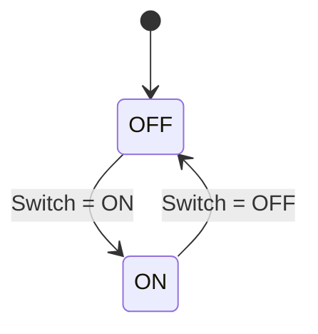

# Template: State machine

````markdown
### States
| State | Description | Output |
|---|---|---|
| OFF | … | … |

### Transitions
| From | To | Condition / Event | Action | Ref |
|---|---|---|---|---|
| OFF | ON | Switch = ON and IGN = ON | Lamp ON within T_LampOn | |


````

- Mỗi transition trong bảng phải xuất hiện trong sơ đồ và ngược lại.
- Transition không có trong spec gốc thì **không thêm**. Nếu thấy thiếu, ghi `> [!question]`.
